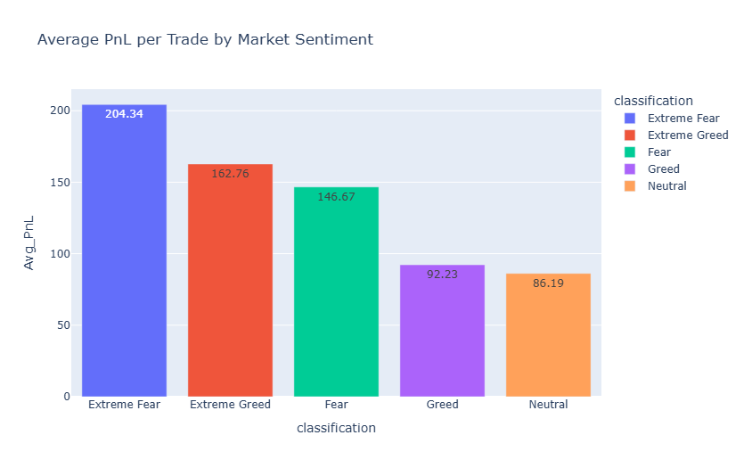
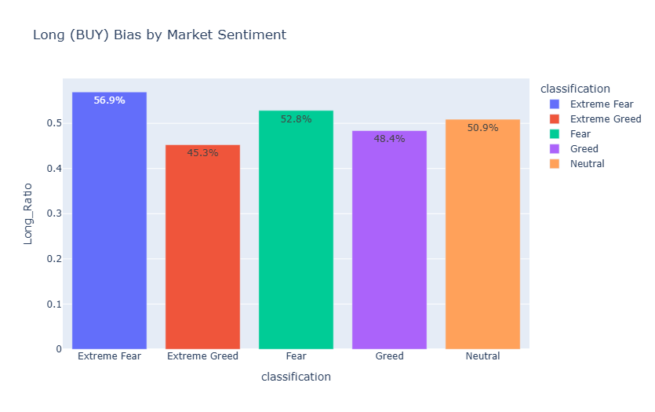

# Hyperliquid Sentiment Analysis: Trader Behavior vs. PnL

**Live Interactive Dashboard:** [Click here to view the live app](https://hyperliquidsentimentanalysis-8xg7eptne9fsbck8jvp7yz.streamlit.app/)
This repository contains the analysis for the Primetrade.ai Data Science Intern Round-0 Assignment. The objective of this project is to explore how broader Bitcoin market sentiment (Fear/Greed) directly influences trader behavior, capital deployment, and overall profitability on the Hyperliquid platform.

## ⚙️ Setup & Execution

**Prerequisites:**
* Python 3.8+
* Required libraries: `pandas`, `numpy`, `plotly`, `streamlit`

**Data Configuration:**
* To reproduce these results, please download the original `historical_data.csv` and `fear_greed_index.csv` datasets provided in the assignment prompt and place them in the root directory of this project. (Raw datasets are excluded from this repo to adhere to standard version control practices).

**How to Run:**
* **Jupyter Notebook:** Open `analysis.ipynb` and execute all cells to view the core data processing, metric engineering, and static visual analysis.
* **Streamlit Dashboard (Bonus):** To run the interactive exploratory dashboard, execute the following command in your terminal:
    ```bash
    streamlit run market_sentiment_dashboard.py
    ```

---

## 🔬 Methodology
Both datasets were ingested and validated for missing values. UNIX and IST timestamps were standardized and converted to a unified `YYYY-MM-DD` format to enable accurate daily merging. 

Key metrics were engineered from the raw execution data, including `Daily_PnL`, `Win_Rate` (binary classification of PnL > 0), and `Long_Ratio` (percentage of BUY sides). The data was then segmented by the sentiment `classification` index to isolate behavioral shifts across changing market conditions.

## 📊 Detailed Data Findings & Visualizations

### 1. Performance Trends (PnL & Win Rates)
* **The Contrarian PnL Spike:** The data reveals a massive profitability spike during periods of "Extreme Fear." Even though the overall win rate during these periods is relatively low (~40.5%), the Average PnL per trade reaches its absolute maximum at **$204.34**. This suggests that while fewer trades win during panic events, the magnitude of the winning trades is exceptionally high.
* **The "Greed" Churn Trap:** Counter-intuitively, as market exuberance rises towards "Greed" and "Neutral," trader edge drops sharply. Average PnL falls to **$92.23** (Greed) and bottoms out at **$86.19** (Neutral). Win rates hover around 47-53%, but the reward profile is drastically reduced, leading to high churn with low payout.



### 2. Behavioral Trends (Capital & Directional Bias)
* **Capital Deployment Paradox:** Traders are committing the highest amount of capital during standard "Fear" periods (Average Trade Size: **$23,119**). Conversely, they deploy the least amount of capital during "Extreme Greed" (**$8,168**). This indicates that the Hyperliquid cohort displays extreme caution and reduces leverage when the broader market is highly exuberant.
* **Long Bias Shifts:** Traders exhibit the strongest Long (BUY) bias during "Extreme Fear" (**56.9%**), effectively "buying the dip." When the market flips to "Extreme Greed," trader behavior reverses heavily into shorts, with Longs making up only **45.2%** of executed trades.



---

## 🚀 Actionable Strategy (Rules of Thumb)
Based on the empirical findings, I propose the following algorithmic rules of thumb:

* **Strategy 1 (Harvest the Panic Premium):** *Algorithmically scale up position sizes and long exposure when the index hits Extreme Fear.* The data proves that while win rates may fluctuate, the payout magnitude (Average PnL) is highest when providing liquidity and buying into market panic.
* **Strategy 2 (Neutral Market Restraint):** *Reduce trade frequency and tighten leverage during Neutral and Greed conditions.* Because Average PnL drops significantly below $100 per trade in these conditions, traders are exposed to higher churn with lower reward profiles. Shift algorithms from directional trend-following to tight mean-reversion during these phases to protect capital.
